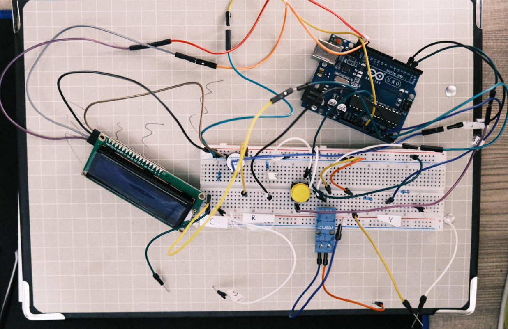
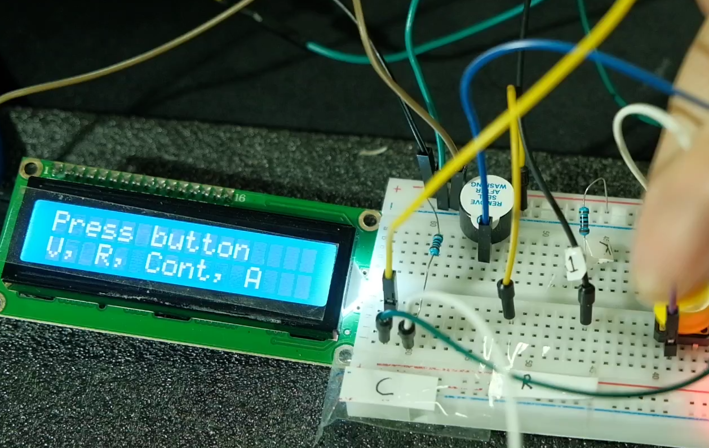
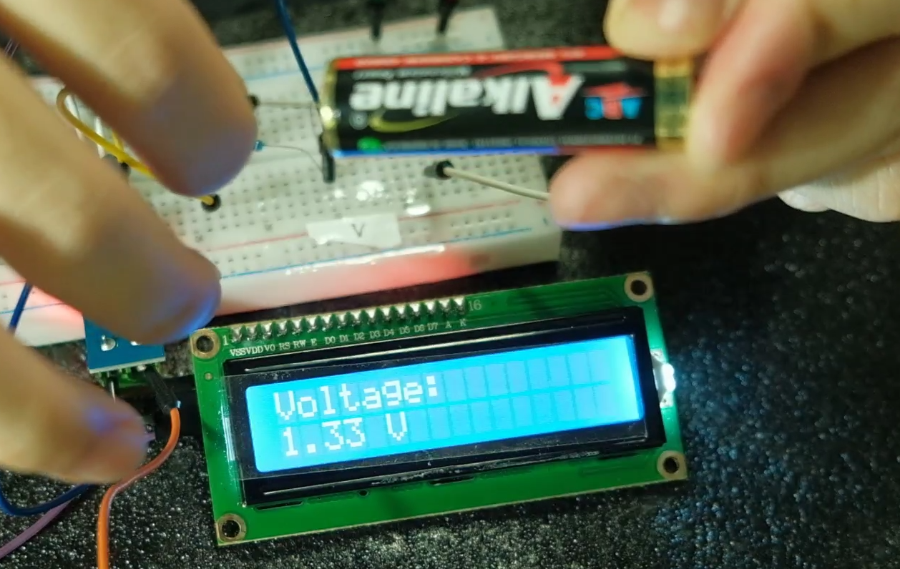
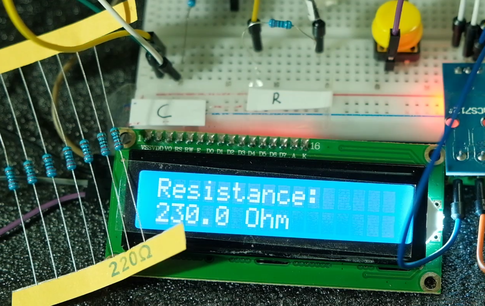
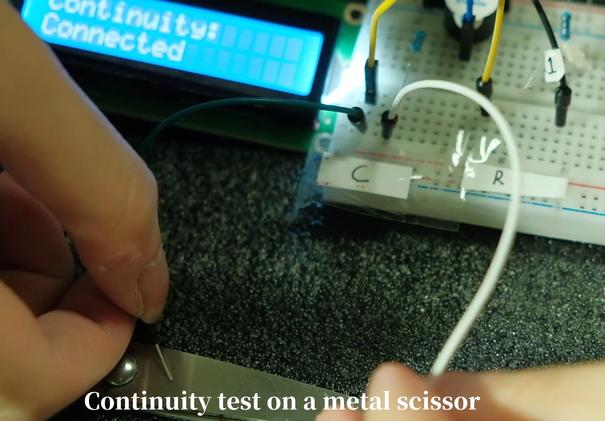
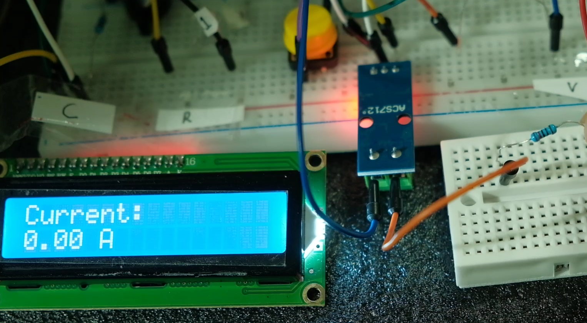
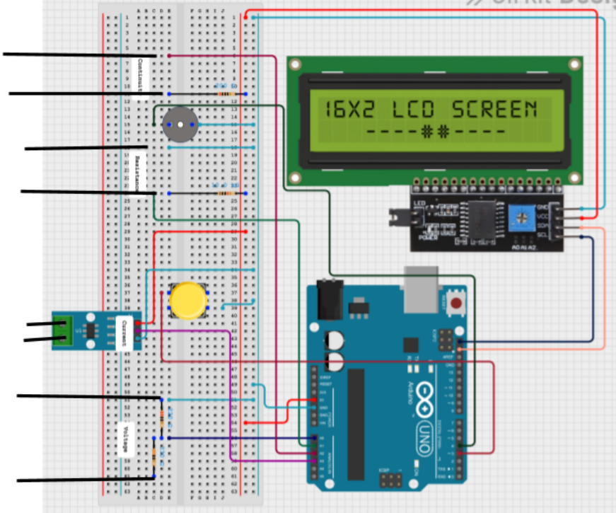

# Arduino Multimeter

This project is an Arduino-based multimeter design to measure basic electronic hobby projects. 

## Features

- Measure voltage, current, and resistance.
- User-friendly interface with an LCD display.
- Portable and easy to assemble.
- Customizable for additional features.

## Components Required

- Arduino board 
- LCD display (16x2 or similar)
- Resistors (330, 220, 10k)
- Wires and connectors
- Breadboard or PCB
- Button
- ACS712 Hall Effect Sensor 

## Installation

1. Clone this repository:
    ```bash
    git clone https://github.com/yourusername/Arduino-Multimeter.git
    ```
2. Open the project in the Arduino IDE.
3. Install any required libraries. 
4. Upload the code to your Arduino board.

## Contributing

Contributions are welcome! Feel free to submit issues or pull requests to improve the project.

## Future

Cable management and need for proper housing
## Extra

Inside the extra folder there are videos on how to operate it and made a concise documentation on this project

## Project Images

Here are some images of the Arduino Multimeter in action:



*Finish Build* 



*Selection Screen*



*Voltage Screen*



*Resistance Screen*



*Continuity Screen*



*Current Screen*



*Digital Layout*
<style type="text/css">
    img {
        width: 300px
    }
</style>